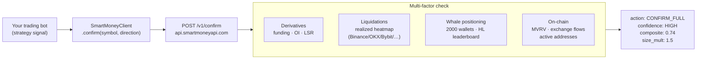

# smartmoneyapi-python

**One GET request. Derivatives + funding + OI + liquidations + whale positioning — before your bot enters.**

[](https://pypi.org/project/smartmoneyapi/)
[](https://pypi.org/project/smartmoneyapi/)
[](LICENSE)
[](https://status.smartmoneyapi.com)
[](https://smartmoneyapi.com/docs.html)
[](https://smartmoneyapi.com)

---

## What it is

[SmartMoneyAPI](https://smartmoneyapi.com) is a trade-confirmation API for crypto bots. Your strategy fires a long or short signal — one call to `/v1/confirm` checks derivatives funding rates, open interest, long/short ratios, multi-exchange liquidation heatmaps, and on-chain whale positioning before your bot enters. It returns `CONFIRM_FULL`, `CONFIRM_REDUCED`, `VETO_SKIP`, or `NO_DATA_SKIP` — not a prediction, but a real-time multi-factor confluence read.

Full API docs: [smartmoneyapi.com/docs.html](https://smartmoneyapi.com/docs.html)

---

## Quickstart

**Install:**

```bash
pip install smartmoneyapi
# or, from source:
pip install git+https://github.com/tashiardit/smartmoneyapi-python.git
```

**Get a free API key** at [smartmoneyapi.com/pricing.html](https://smartmoneyapi.com/pricing.html) (50 calls/day, no credit card).

```bash
export SMARTMONEY_API_KEY=sm_your_key_here
```

**Call it:**

```python
from smartmoneyapi import SmartMoneyClient

client = SmartMoneyClient()                # reads SMARTMONEY_API_KEY env var
result = client.confirm("BTC", "long")

print(result["action"])       # CONFIRM_FULL | CONFIRM_REDUCED | CONFIRM_MINIMAL | VETO_SKIP | NO_DATA_SKIP
print(result["confidence"])   # HIGH | MEDIUM | LOW | VETO | NO_DATA
print(result["composite"])    # -1.0 → +1.0 confluence score (not a win-rate)
print(result["size_mult"])    # suggested position-size multiplier, e.g. 1.5 or 0.5
```

**Response shape:**

```json
{
  "symbol": "BTC",
  "direction": "long",
  "action": "CONFIRM_FULL",
  "confidence": "HIGH",
  "composite": 0.74,
  "size_mult": 1.5,
  "deriv_score": 0.81,
  "onchain_score": 0.52,
  "whale_score": 0.67,
  "factors": {
    "derivatives": { "score": 0.81, "weight": 0.40, "weighted": 0.324 },
    "onchain":     { "score": 0.52, "weight": 0.35, "weighted": 0.182, "source": "coinmetrics" },
    "whale":       { "score": 0.67, "weight": 0.25, "weighted": 0.168 }
  },
  "adjustments": { "agreement": 0.03, "trend": 0.01, "rsi_1h": 0.0, "streak_decay": 0.0 },
  "coverage": { "derivatives": true, "whale": true, "onchain": true },
  "reasons": ["Funding neutral across venues", "Open interest expanding long", "Whale flow 63% long"]
}
```

Your bot reads `action`. `composite` runs -1.0 → +1.0 and is a confluence read — **not a win-rate** (see [calibration](https://smartmoneyapi.com/calibration.html)).

---

## Flow diagram



---

## Endpoint reference

| Endpoint | Tier | Returns |
|---|---|---|
| `GET /v1/confirm` | Free+ | Multi-factor trade confirmation: `action`, `confidence`, `composite`, `factors`, `reasons` |
| `GET /v1/stats` | Public | Live signal performance + methodology (win-rates with sample sizes) |
| `GET /v1/signals/performance` | Public | Forward-holdout signal track record per horizon |
| `GET /v1/derivatives/screener` | Free (top 10) / Trader+ (full) | Funding heatmap, OI rankings, LSR across 500+ symbols |
| `GET /v1/derivatives/funding-arb` | Trader+ | Funding-rate arbitrage opportunities (cross-venue spreads) |
| `GET /v1/whales/events` | Public | Recent whale wallet trade events |
| `GET /v1/whales/summary` | Public | Aggregate whale positioning by symbol |
| `GET /v1/whale-consensus` | Trader+ | Cross-chain whale consensus with per-chain flow breakdown |
| `GET /v1/liquidations` | Free (levels) / Trader+ (heatmap) | Leverage-projected levels + real executed liq heatmap (multi-exchange) |
| `GET /v1/liquidations/onchain` | Trader+ | Executed DeFi lending liquidations from BSC + Avalanche nodes |
| `GET /v1/onchain/tvl` | Public | DeFi TVL (DeFiLlama) |
| `GET /v1/onchain/btc` | Public | BTC on-chain: hash rate, difficulty, mempool, transactions |
| `GET /v1/onchain/gas` | Public | Ethereum gas (Etherscan) |
| `GET /v1/etf/flows` | Public | BTC + ETH ETF daily flows (SoSoValue) |
| `GET /v1/options/btc` | Public | BTC options: PCR, max pain, OI by strike (Deribit) |
| `GET /v1/options/eth` | Public | ETH options: PCR, max pain, OI by strike (Deribit) |
| `GET /v1/market/indices` | Public | Altcoin Season Index, BTC dominance, CME basis |
| `GET /v1/signals/recent` | Public | Most recent signals with outcome resolution status |
| `GET /v1/shadow-gate/decisions` | Trader+ | Shadow-gate decision log (latency + pass/fail per signal) |
| `POST /v1/alerts/conditions` | Pro | Create a custom threshold alert (funding, whale %, composite, …) |
| `POST /v1/webhooks` | Pro | Register HMAC-signed outbound webhook for signal events |
| `POST /v1/tradingview/webhook` | Trader+ | Inbound TradingView alert → auto-confirm |
| `GET /v1/usage` | Authed | Your plan usage + remaining calls |

Base URL: `https://api.smartmoneyapi.com`  ·  Auth header: `X-API-Key: <your_key>`

---

## Tiers

| Tier | Calls / day | Symbols | Key endpoints |
|---|---|---|---|
| **Free** | 50 | BTC only | `/v1/confirm`, public market data, derivatives screener (top 10) |
| **Trader** | 1,000 | All 200+ | Full screener, liquidation heatmap, on-chain liqs, whale consensus, funding-arb |
| **Pro** | 5,000 | All + priority | + Custom alerts, outbound webhooks, full historical data |
| **Enterprise** | 100,000 | All + SLA | Dedicated support, custom limits, raw data access |

Get your key: [smartmoneyapi.com/pricing.html](https://smartmoneyapi.com/pricing.html)

---

## More examples

**Liquidation heatmap:**

```python
liqs = client.get_liquidations("ETH")
print(liqs["cascade_risk"])          # HIGH | MEDIUM | LOW
print(liqs["nearest_long_liq_pct"])  # % below current price
print(liqs["realized_heatmap"]["totals"]["total_notional"])
```

**On-chain DeFi liquidations (Trader+):**

```python
onchain = client.get_onchain_liquidations(chain="bsc", limit=50)
for liq in onchain["liquidations"]:
    print(liq["protocol"], liq["debt_symbol"], liq["repay_usd"])
```

**Custom alerts (Pro):**

```python
# Fire a Telegram alert when BTC funding rate exceeds 0.05%
client.create_alert(
    name="BTC funding spike",
    metric="funding_rate",
    operator="gt",
    threshold=0.05,
    symbol="BTC",
    delivery="telegram",
    cooldown_minutes=60,
)
```

**HMAC webhook verification:**

```python
from smartmoneyapi import verify_webhook_signature

# In your webhook handler:
is_valid = verify_webhook_signature(
    raw_body=request.body,
    signature_header=request.headers["X-SmartMoney-Signature"],
    secret="your-registered-secret",
)
```

---

## A note on signal accuracy

Published accuracy figures are measured on resolved signals and are in-sample. Forward-holdout track record is live and accruing at [smartmoneyapi.com/calibration.html](https://smartmoneyapi.com/calibration.html). `composite` is a confluence score, not a predicted win-rate. Crypto trading involves substantial risk — this is decision support, not financial advice.

---

## Contributing

Issues and PRs welcome. This repo is the public SDK + examples. The API backend is private.

1. Fork the repo
2. Create a feature branch (`git checkout -b feature/my-change`)
3. Commit your changes
4. Open a PR

---

## License

MIT — see [LICENSE](LICENSE).
